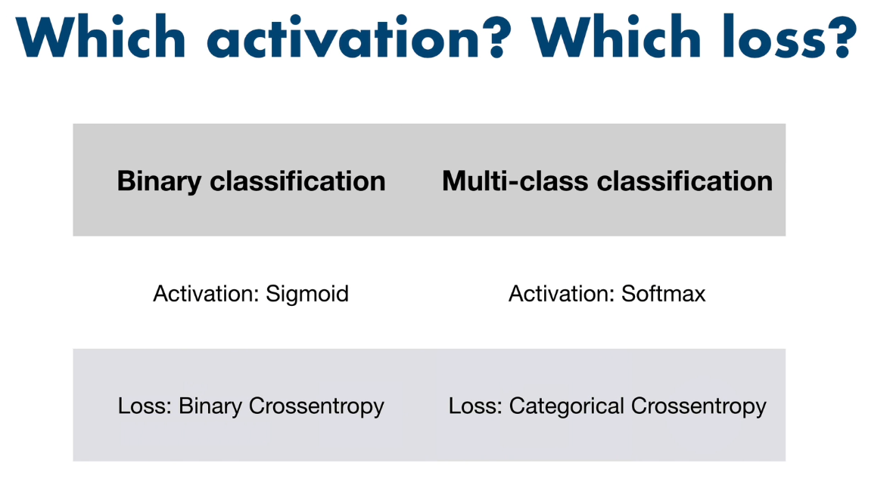

# Project Notes
## Useful Files in this Repository Branch

[](https://github.com/Diegomca98/research-and-learning/blob/dog-breed-id/README.MD)
[](https://github.com/Diegomca98/research-and-learning/blob/dog-breed-id/NOTEBOOK_STRUCTURE.MD)
[](https://github.com/Diegomca98/research-and-learning/blob/dog-breed-id/USEFUL_RESOURCES.MD)

## Notes
To work with TensorFlow we have to transform the data into Tensors, the Tensors are pretty similar to Numpy Arrays:
* If preprocessing images we use `matplotlib.pyplot.imread(filename)` we'll get a `h by width by color_channel` Numpy Array and if we transform the image to tensors using `tensorflow.constant(filename)` we will get the same result as the Numpy Array, but as type `tensorflow.Tensor`
  
  ```python
  np_array = matplotlib.pyplot.imread(image)
  tensor = tensorflow.constant(image)

  np_array[:2], tensor[:2]

  <Output>:
    (array([[[ 89, 137,  89],
         [ 76, 124,  76],
         [ 63, 111,  61],
         ...,
         [ 77, 133,  86],
         [ 76, 134,  86],
         [ 76, 134,  86]],
 
        [[ 72, 119,  75],
         [ 67, 114,  68],
         [ 63, 110,  64],
         ...,
         [ 75, 131,  84],
         [ 74, 132,  84],
         [ 74, 132,  84]]], dtype=uint8),
    <tf.Tensor: shape=(2, 350, 3), dtype=uint8, numpy=
    array([[[ 89, 137,  89],
            [ 76, 124,  76],
            [ 63, 111,  61],
            ...,
            [ 77, 133,  86],
            [ 76, 134,  86],
            [ 76, 134,  86]],
    
            [[ 72, 119,  75],
            [ 67, 114,  68],
            [ 63, 110,  64],
            ...,
            [ 75, 131,  84],
            [ 74, 132,  84],
            [ 74, 132,  84]]], dtype=uint8)>)
  ```

##
The model we build at first using `tf.keras.Sequential()` is going to look like this in a diagram:
  ```
  A[Input Layer] --> B[KerasLayer from Hub]
    B --> C[Dense Layer (softmax)]
    C --> D[Output Layer]
  ```
  * This model has:
    * An input layer A that accepts input data of shape input_shape
    * Layer 1 B is a KerasLayer loaded from TensorFlow Hub. This applies pretrained feature extraction.
    * Layer 2 C is a dense layer with softmax activation to output probabilities.
    * An output layer D that makes predictions.

  * The key aspects are:
    * 2 layers - the Hub KerasLayer and a Dense output layer
    * Sequential stack - each layer feeds into the next linearly
    * Input shape defined separately when model is built, not in layers
    * Compile adds loss, optimizer, metrics for training
  * Which Activation and Which Loss:
  

##
The `Early Stopping Callback` from keras has an attribute called `patience`, this attribute description says:

> Number of epochs with no improvement after which training will be stopped.

**What is an epoch?**

An epoch refers to one full pass through the entire training dataset in machine learning. Some key points:

* An epoch means the model has seen all the training examples once.
* One epoch = one forward pass + one backward pass of all the training examples.
* The number of epochs is a hyperparameter that defines the number times the learning algorithm will work through the entire training dataset.
* Typical epoch values tend to be between 20-100 depending on dataset size, model complexity, learning rate etc.
* After every epoch, the model parameters are updated based on the loss gradient calculated over the epoch.
* The number of epochs is usually tuned through monitoring loss/accuracy on a validation set. Too few epochs leads to underfitting while too many lead to overfitting.
* So setting a stop condition based on no improvement in validation loss after some epochs helps prevent overfitting.

In summary, an epoch refers to one full pass through the entire training set updating model weights. The number of epochs controls how many times the algorithm sees the entire dataset. Specifying a patience hyperparameter based on epochs is useful to stop training if validation performance stops improving.

##
When training a model for the first time, specially with image data or any other type of large scale data, the first epoch is the longest compared to the rest.

This is because it's getting the data and initializing, aka. loading the data into the memory, that's why it's good to use a subset of the training data, so if the first epoch takes a couple minutes, the following epochs should take seconds.