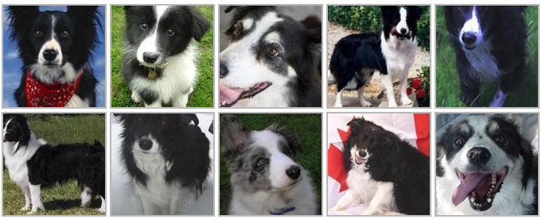

# Dog Breed Identification
Determine the breed of a dog in an image

[](https://en.wikipedia.org/wiki/Machine_learning)
[](https://en.wikipedia.org/wiki/Deep_learning)
[](https://en.wikipedia.org/wiki/Artificial_neural_network)
[](https://en.wikipedia.org/wiki/Transfer_learning)
[](https://www.udemy.com/)
[](https://www.kaggle.com/)
[](https://en.wikipedia.org/wiki/List_of_dog_breeds)


[](https://www.tensorflow.org/guide/gpu)

## Project Information
This project was taken from [Complete A.I. & Machine Learning, Data Science Bootcamp](https://www.udemy.com/course/complete-machine-learning-and-data-science-zero-to-mastery/), specifically the module **Neural Networks: Deep Learning, Transfer Learning and TensorFlow 2**.

In this multiclass classification project we will use a GPU to create a neural network and train it using TensorFlow and Transfer Data with the data downloaded from [Kaggle **Closed** Competition](https://www.kaggle.com/c/dog-breed-identification/overview) to the folders `/data/train` and `/data/test`, we will follow the requirements of the competition to analyze the data and create the models necessary to identify the dog breed listed in the `/data/labels.csv`.

For this project we are going to have 3 sets, the *`train`* and *`test`* sets provided by Kaggle and we are going to create a *`validation`* set to experiment with a subset of images, making it faster and easier to find out what works and what don't, in this case the validation set is going to start at **~1K** images and we will be increasing it as needed. **Here is a little diagram with an analogy to understand the 3 sets mentioned above:**


### Notebook Structure

```
Notebook Structure
|
├── 1. Setup Workspace
|   └── ✔️ Create Google Colab Notebook
├── 2. Link Drive
|   └── ✔️ Upload Data to Drive
├── 3. Import
|   ├── ✔️ TensorFlow
|   ├── ✔️ TensorFlow Hub
|   └── ✔️ Setting up a GPU for use
├── 4. Loading and Checking Data
|   ├── ✔️ Loading Data Labels
|   ├── ✔️ Preparing the Images
|   └── ✔️ Turning Data into Numbers
├── 5. Split Data into Sets
|   ├── ✔️ from sklearn.model_selection import train_test_split
|   └── ✔️ Separate Train Data into x_train, y_train, x_val, y_val
├── 6. Preprocess Images
|   ├── ✔️ Take img_path and img_size as inputs
|   ├── ✔️ Use TensorFlow to read the file and save it to a variable called img
|   ├── ✔️ Turn our image (jpg) into Tensors
|   ├── ✔️ Normalize our image tensor (convert color channel values from 0-255 to 0-1)
|   ├── ✔️ Resize the image to be (224,224)
|   ├── ✔️ Return the `mod_image`
├── 7. Turn Data into Batches
|   ├── ✔️ Function to return a tuple of Tensors. Takes img_path and label as inputs
|   ├── ✔️ Function to turn our data into 32 sized batches with logic dependant on the type of set (Training, Validation or Test)
|   ├── ✔️ Create and check training and validation data batches
|   ├── ✔️ Visualizing Data to better understand the batches
├── 8. Preparing Our Inputs and Outputs
├── 9. Model Experiments
|   ├── 🕜 Building the Model
|   ├── 🕜 Evaluating the Model
|   └── 🕜 Preventing Overfitting
├── 10. Deep Neural Network
|   ├── 🕜 Training the DNN
|   ├── 🕜 Evaluating Performance with TensorBoard
|   ├── 🕜 Make Predictions
|   ├── 🕜 Transform Predictions to Text
|   ├── 🕜 Visualizing Predictions
|   └── 🕜 Evaluate Predictions
├── 11. Model
|   ├── 🕜 Save Model
|   └── 🕜 Load Model
├── 12. Test Data Predictions
|   ├── 🕜 Predictions with Test Data
|   └── 🕜 Predictions with our own Images
└── 13. Submit the model to Kaggle
```
## Competition Overview
### Description
> Who's a good dog? Who likes ear scratches? Well, it seems those fancy deep neural networks don't have all the answers. However, maybe they can answer that ubiquitous question we all ask when meeting a four-legged stranger: what kind of good pup is that?
> 
> In this playground competition, you are provided a strictly canine subset of ImageNet in order to practice fine-grained image categorization. How well you can tell your Norfolk Terriers from your Norwich Terriers? With 120 breeds of dogs and a limited number training images per class, you might find the problem more, err, ruff than you anticipated.



### Evaluation
Submissions are evaluated on [Multi Class Log Loss](https://www.kaggle.com/wiki/MultiClassLogLoss) between the predicted probability and the observed target.

## Features
Some information about the data
* We're dealing with images(unstructured data)
* There are 120 breed of dogs (Meaning there are 120 different classes)
* There are around 10k+ images in the training set(This set has labels)
* There are around 10k+ images in the test set(This set doesn't have labels)

## Notes
* To work with TensorFlow we have to transform the data into Tensors, the Tensors are pretty similar to Numpy Arrays:
  * If preprocessing images we use `matplotlib.pyplot.imread(filename)` we'll get a `h by width by color_channel` Numpy Array and if we transform the image to tensors using `tensorflow.constant(filename)` we will get the same result as the Numpy Array, but as type `tensorflow.Tensor`
  
  ```python
  np_array = matplotlib.pyplot.imread(image)
  tensor = tensorflow.constant(image)

  np_array[:2], tensor[:2]

  <Output>:
    (array([[[ 89, 137,  89],
         [ 76, 124,  76],
         [ 63, 111,  61],
         ...,
         [ 77, 133,  86],
         [ 76, 134,  86],
         [ 76, 134,  86]],
 
        [[ 72, 119,  75],
         [ 67, 114,  68],
         [ 63, 110,  64],
         ...,
         [ 75, 131,  84],
         [ 74, 132,  84],
         [ 74, 132,  84]]], dtype=uint8),
    <tf.Tensor: shape=(2, 350, 3), dtype=uint8, numpy=
    array([[[ 89, 137,  89],
            [ 76, 124,  76],
            [ 63, 111,  61],
            ...,
            [ 77, 133,  86],
            [ 76, 134,  86],
            [ 76, 134,  86]],
    
            [[ 72, 119,  75],
            [ 67, 114,  68],
            [ 63, 110,  64],
            ...,
            [ 75, 131,  84],
            [ 74, 132,  84],
            [ 74, 132,  84]]], dtype=uint8)>)
  ```
  * 

## Useful Resources
For Google Colab working environment you can check the following resources:
* [Welcome To Colaboratory](https://colab.research.google.com/notebooks/intro.ipynb)
* [External data: Local Files, Drive, Sheets, and Cloud Storage](https://colab.research.google.com/notebooks/io.ipynb)
* [Google Colab FAQ](https://research.google.com/colaboratory/faq.html)
* [TensorFlow with GPU](https://colab.research.google.com/notebooks/gpu.ipynb)
* [@param Google Colab Forms](https://colab.research.google.com/notebooks/forms.ipynb)

For information about good practices, recommendations, etectera for working with this kind of data and models you can check the following resources:
* [Prepare image training data for classification](https://cloud.google.com/vertex-ai/docs/image-data/classification/prepare-data)

TensorFlow Documentation and Useful Resources:
* [TensorFlow Official Site](https://www.tensorflow.org/)
* [TensorFlow Docs](https://www.tensorflow.org/guide)
* [TensorFlow Tutorials](https://www.tensorflow.org/tutorials)
* [Load and Preprocess Images](https://www.tensorflow.org/tutorials/load_data/images)
* [tf.data: Build TensorFlow input pipelines](https://www.tensorflow.org/guide/data)

## Warnings
* In case you choose to work using VS Code, Anaconda or any other local environment you might use this repository and check information about how to use a GPU with Tensorflow(Link in the badges) and information on GPU Capability from [NVIDIA](https://developer.nvidia.com/cuda-gpus)

* Since the data from the `dog-breed-identification.zip` is to much if I upload it unzipped I get up to 10k+ changes to commit, therefore I added `*.jpg` to the `.gitignore` file, you can go to the following link to the [Kaggle Competition Data tab](https://www.kaggle.com/c/dog-breed-identification/data) and either choose the files you want to download or click on the `Download All` button to get the `train/*.jpg`, `test/*.jpg`, `labels.csv` and `sample_submission.csv`
